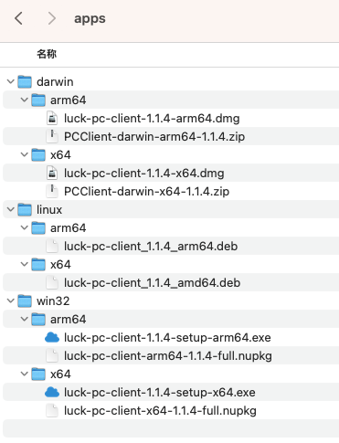

# update-server-uploader

项目旨在提供一个`Electron Nucleus`应用版本文件批量上传工具。解决在私有化或者网络受限场景应用版本批量发布的问题。

> 注：可以利用`Github Action`等持续集成工具，先将应用在各环境中打包，然后再将文件下载下来，统一上传到`Nucleus`应用更新服务器中。

[简体中文](./README-zh_CN.md) | [English](./README.md)

# 使用

## 命令行使用：
```
// 命令有两个参数，第一个是版本号，一个是更新文件根目录位置
npx electron-update-server-uploader 1.1.4 /Users/peiyandong/Downloads/apps
```

## 源码式使用：
```
git clone https://github.com/lucksoft-yungui/update-server-uploader.git
cd update-server-uploader
npm i
// 命令有两个参数，第一个是版本号，一个是更新文件根目录位置
npm run upload -- 1.1.4 /Users/test/Downloads/apps
```

根目录结构如下图：

  

# 相关项目

- [electron-update-server](https://github.com/lucksoft-yungui/electron-update-server) 支持mac、win、linux平台及x64、arm64架构的应用版本及分发服务
- [luck-electron-auto-updater](https://github.com/lucksoft-yungui/luck-electron-auto-updater) 支持mac、win、linux平台的自动更新组件


